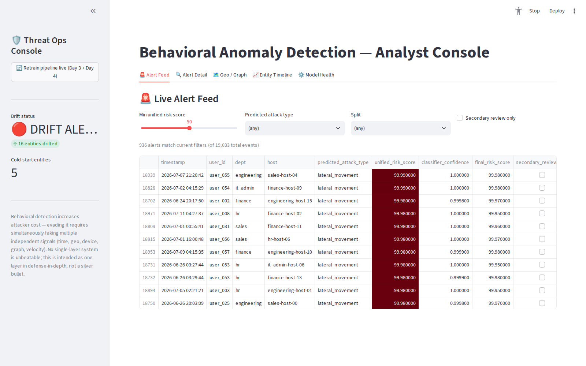
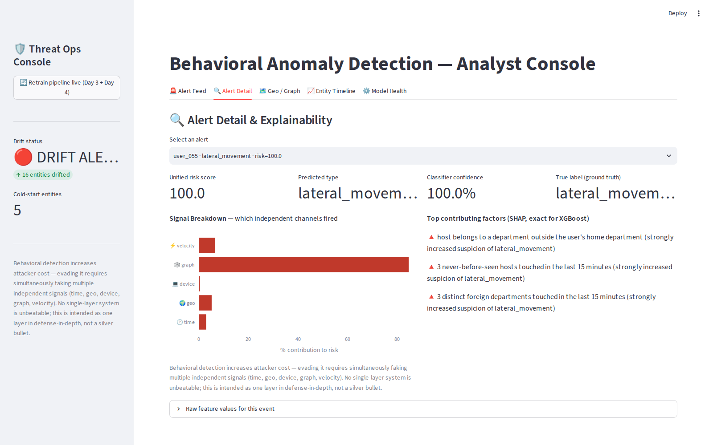
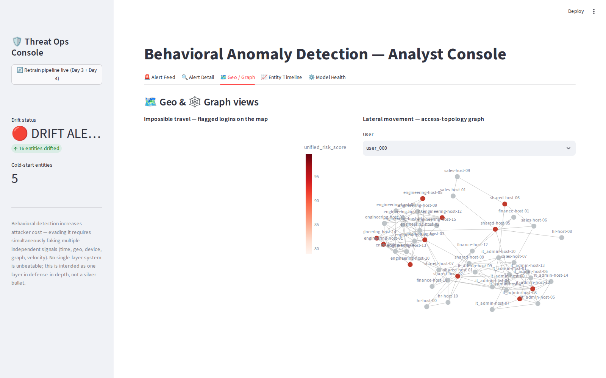
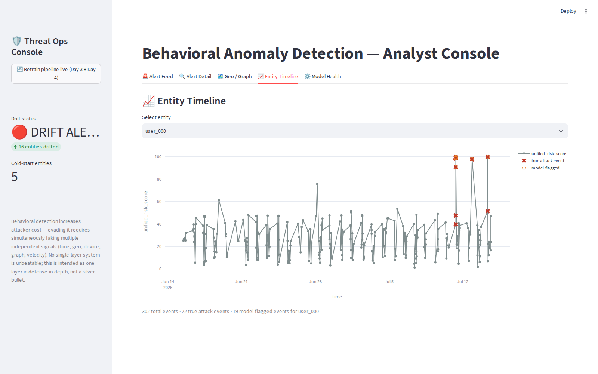
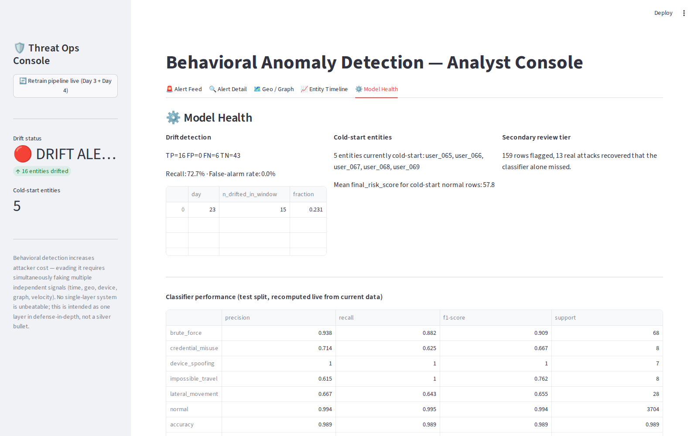

# Behavioral Anomaly Detection for Cybersecurity

An AI/ML system that learns *normal* per-user and per-device access behavior — rather
than relying on attack signatures — and flags credential misuse, brute-force attacks,
lateral movement, impossible travel, and device spoofing in near real time, with
explainable per-alert risk scores and an analyst dashboard.

All metrics below are reproducible directly from this repo — none are hand-picked.

## Dashboard






## Why behavioral detection, not signatures

Signature-based tools catch known attack patterns. They miss a legitimate credential
used at 3am from a new city, or an account touching hosts it's never touched before —
there's no "signature" for that, only a deviation from an individual's own baseline.
This system builds that baseline per entity, per department, and flags deviations from
it, with two complementary model layers explained below.

## Architecture

```
synthetic_logs.csv (generate_logs.py)
        │  70 users, 5 depts, ~90-host access graph, 30-day sim,
        │  1 baked-in concept-drift event, 5 cold-start "new hires"
        ▼
features.py  ── 13 strictly-causal behavioral features per event
        │        (never uses future information relative to that event)
        ▼
┌────────────────────────┬──────────────────────────────┐
│         Unsupervised   │          Supervised          │
│  Isolation Forest +    │   XGBoost multi-class        │
│  Autoencoder ensemble  │  classifier, SMOTE +         │
│  (normal-only training)│  balanced weights +          │
│  → 0–100 anomaly score │  domain-precondition gate    │
│  + cold-start blending │  → attack type + confidence  │
└───────────┬────────────┴──────────────┬───────────────┘
            └───────────┬───────────────┘
                        ▼
              unified_risk_score (merged, validation-selected rule)
                        │
        ┌───────────────┴───────────────┐
        ▼                               ▼
  drift.py (per-entity ADWIN,     explain.py (SHAP TreeExplainer,
  population-level retrain        exact per-alert attributions)
  trigger)                                │
                        ▼                 ▼
                  app.py — Streamlit analyst dashboard
```

**Why two model layers, not one:** the unsupervised layer never sees a single attack
label — it only knows "normal." That makes it good at catching *distributed*
anomalies (unusual combinations across many features) but structurally bad at
catching a single deterministic flag (e.g. `fingerprint_mismatch=1` for
device_spoofing) that gets diluted across 12 unremarkable features. The supervised
XGBoost layer, trained directly on attack labels, learns exactly that per-feature
importance. Measured effect: device_spoofing recall goes from **21.1%** (unsupervised
alone, at a 5% FP budget) to **100%** (with the supervised layer) — this is the
concrete, measured reason the pipeline has two layers instead of one.

## Quickstart

```bash
pip install -r requirements.txt
cd src
python3 generate_logs.py   # only if you want a fresh synthetic dataset
python3 features.py        # feature engineering
streamlit run app.py       # opens the dashboard
```

If `models/` is empty, click **"Retrain pipeline live"** in the dashboard sidebar —
it actually runs `run_day3.main()` + `run_day4.main()` (real training, not a log
line), takes roughly 60–90 seconds on a laptop, and streams the console output live.

## Repo structure

```
src/
  generate_logs.py      synthetic log + entity + attack-session generator
  features.py           causal feature engineering (13 behavioral features)
  models.py             unsupervised - Isolation Forest + Autoencoder ensemble
  coldstart.py          unsupervised — population-baseline blending for thin-history entities
  run_day3.py              unsupervised driver — trains, scores, saves scored_events.csv
  classifier.py             supervised — XGBoost multi-class classifier, SMOTE, precondition gate
  run_day4.py                supervised driver — 3-way split, merge-rule selection, day4_results.csv
  drift.py                    per-entity ADWIN drift detection + retrain trigger
  explain.py                  SHAP TreeExplainer, plain-language alert factors
  app.py                      Streamlit analyst dashboard
data/                            generated logs, features, scored/classified events
models/                           trained model artifacts (.joblib)
requirements.txt
```

## Handling the three hard requirements explicitly

**Class imbalance** — attack events are ~2.7% of traffic and the rarest attack types
are ~38 incidents out of 19,033 events. Handled with SMOTE (train split only, never
test) + inverse-class-frequency sample weights + a domain-precondition gate (e.g.
`brute_force` requires `failure_burst_count >= 1` — a necessary condition drawn
directly from the attack's own definition, so it can only remove impossible
predictions, never a correct one).

**Concept drift** — a baked-in WFH policy shift on day 20 moves 22/70 users to a new
city and new working hours. Detected with one independent ADWIN instance per entity
(population-pooled ADWIN was tried first and never converged — confirmed empirically,
see `drift.py` docstring) with zero false alarms on the 43 non-drifted users.

**Cold-start** — 5 brand-new-hire entities appear only after day 22 with no history.
Their unsupervised anomaly score is blended toward their department's population
median, weighted by how much personal history they've accumulated — mean score for
cold-start normal behavior pulled from 76.85 down to 57.82, below the alert threshold.

## Verified metrics

See `METRICS_REPORT.md` for the full breakdown. Headline numbers:

| Layer | Metric | Value |
|---|---|---|
| (unsupervised ensemble) | ROC-AUC | 0.9458 |
|       | Overall attack recall @ 5% FP | 82.9% |
|       (XGBoost classifier) | Test accuracy | 98.9% |
|       | Macro F1 | 0.832 |
|       | FP rate on normal test rows | 0.54% |
|       | device_spoofing recall | 100% |
| Drift detector | Recall / false-alarm rate | 68.2% / 0% |
| Explainability | SHAP latency per alert (batch) | 1.68 ms |

## Known limitations (disclosed, not hidden)

- `lateral_movement` and `credential_misuse` test-set recall (64.3% / 62.5%) are
  weaker than other classes — partly a small-sample artifact (n=28, n=8 in test),
  partly because these two attack types are deliberately left ungated (no single
  necessary precondition exists for them the way `failure_burst_count` does for
  brute_force).
- `impossible_travel` precision is 61.5% — its false positives are a distinct,
  understood cause (the event immediately after a real attack inherits a
  contaminated "last known location" for geo-velocity), not classifier noise, so it
  was deliberately left ungated rather than papered over.
- The "Retrain pipeline live" button retrains all three models on the full dataset
  (~60–90s) — this demonstrates a real retrain loop, but a production deployment
  would trigger this asynchronously on a schedule, not synchronously in a UI thread.
- This is one layer in defense-in-depth, not a complete security solution — evading
  it requires simultaneously faking multiple independent signals (time, geo, device,
  graph, velocity), which raises attacker cost, but no single-layer system is
  unbeatable.
